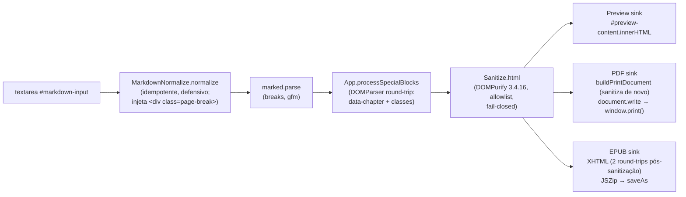

# ARCHITECTURE — md2pdf

Dono: arquiteto. Documenta o desenho atual do produto; qualquer mudança
estrutural deve atualizar este documento e registrar a decisão em
`docs/decisions/`.

## 1. Contexto e restrições

md2pdf é um editor **Markdown → PDF/EPUB3 100% client-side**: HTML/CSS/JS
vanilla, **sem build step**, sem framework, sem TypeScript, sem backend, sem
autenticação, sem banco. PWA com cache offline (service worker). Deploy em
Cloudflare Pages (`md2pdf-free-studio.pages.dev` — canonical em
`index.html:14`). O desvio de stack em relação ao `_template` é intencional e
registrado em **ADR-002**.

Duas restrições governam todo o desenho:

### (a) O motor de PDF é `window.print()` — ADR-001

A exportação PDF abre uma janela (`window.open('', '_blank')`,
`pdf-generator.js:383`), escreve um documento HTML completo
(`document.write`, `:394`) e delega a impressão ao navegador
(`printWindow.print()`, `:397`). O resultado final depende do driver de
impressão do navegador do usuário. **Não trocar de motor sem decisão
registrada** (ADR-001; regra gravada no `AGENTS.md`). As alternativas
(`html2pdf.js`, `jsPDF`, `pdfmake`, `Paged.js`) foram avaliadas e rejeitadas
no ADR-001 — Chromium implementa CSS Paged Media L3 nativamente desde a
v131, então `@page`, margin boxes e `counter(page)` funcionam sem
dependência.

Consequência estrutural: o documento de impressão é **uma string HTML
montada em `buildPrintDocument`** (função pura) e o CSS de impressão existe
em **três lugares** que precisam concordar (ver §3 e `PRINT-PROFILE.md`) —
mudar um e esquecer os outros produz preview e PDF divergentes, o defeito
mais provável deste produto.

### (b) A ordem de carregamento dos scripts é funcional

Todos os scripts de `index.html:342-364` usam `defer` (ordem de documento
preservada). A restrição explícita: **o sanitizador tem de existir antes do
primeiro render do preview** — DOMPurify (`js/vendor/dompurify.min.js`,
`:347`) **antes** de `js/sanitize.js` (`:348`), que **antes** de
`js/preview.js` (`:354`). O primeiro render só acontece em `App.init()`
disparado por `DOMContentLoaded` (`app.js:561`), ou seja, depois de todos
os `defer` — a ordem é garantida por construção, mas é um contrato de
wiring: inverter o vendor e o módulo quebra o fail-closed (sem DOMPurify,
`Sanitize.html` devolve `''`, ADR-003 D2).

```
index.html:342-344  marked 9.1.2, jszip 3.10.1, FileSaver 2.0.5 (CDN, sem SRI — P3)
index.html:347      js/vendor/dompurify.min.js   ← self-host (ADR-003 D1)
index.html:348      js/sanitize.js               ← Sanitize
index.html:350-354  i18n, storage, themes, markdown-normalize, preview
index.html:355-364  find-replace, stats, image-manager, templates,
                    theme-editor, pdf-generator, epub-generator, pix,
                    editor, app (último, inicia tudo)
index.html:367-373  registro do SW (script inline, executa imediato)
```

## 2. Mapa de módulos

| Arquivo | Responsabilidade | Liga-se a |
|---|---|---|
| `index.html` | Shell da UI, ordem de scripts (contrato §1b), registro do SW, metadados SEO/PWA | Todos os módulos via ordem `defer` |
| `css/` (6) | `main.css`, `editor.css`, `preview.css`, `modals.css`, `print.css`, `pix.css` | Estilo da UI; `print.css` é o perfil de impressão do app |
| `js/vendor/dompurify.min.js` | DOMPurify 3.4.16 self-hosted (ADR-003 D1); primeiro-party, pré-cacheado no SW | `Sanitize.html` (lazy via `window.DOMPurify`) |
| `js/sanitize.js` | `Sanitize`: `html`, `watermark`, `color`, `attr` — fronteira de segurança do pipeline | preview, pdf-generator, epub-generator, themes, theme-editor, image-manager (modal) |
| `js/i18n.js` | `I18n`: traduções pt-BR/en/es | Todos os modais e textos `data-i18n` |
| `js/storage.js` | `Storage` (wrapper `localStorage` com prefixo `md2pdf_`), `ProjectManager` (projetos + versões + import/export), `AutoSave` | app, editor, pdf-generator, i18n |
| `js/themes.js` | 50 temas (`THEMES`), `ThemeManager` (CSS de tema, preview, lista, temas do usuário), `getGoogleFontsLink`, shim `StorageManager` | preview, pdf-generator, epub-generator, app, theme-editor |
| `js/markdown-normalize.js` | `MarkdownNormalize.normalize` — normalização de Markdown de IA (frontmatter, hierarquia de títulos, whitespace) e injeção de `<div class="page-break">` **antes** do parse | preview, epub-generator |
| `js/preview.js` | `Preview` — render WYSIWYG (debounce 150 ms), scroll sync, fonte do tema | app (`App.updatePreview`), themes |
| `js/find-replace.js` | `FindReplace` — busca/substituição no textarea (Ctrl+F/Ctrl+H) | editor (toolbar), app |
| `js/stats.js` | `Stats` — contadores e modal de estatísticas (números + i18n, sem vetor — S7) | app, editor |
| `js/image-manager.js` | `ImageManager` — inserir imagem por URL/upload (ImgBB), `isValidImageUrl`, previews via DOM | app, editor, epub-generator |
| `js/templates.js` | `Templates` — templates editoriais (8) e capa (corpo não lido integralmente — §6) | editor (toolbar) |
| `js/theme-editor.js` | `ThemeEditor` — editor visual de temas do usuário (self-XSS, sem import cross-user) | editor, themes |
| `js/pdf-generator.js` | `PDFGenerator` — settings de página, `buildPrintDocument` (função pura), `generate()` (`window.print`) | app, editor, sanitize, themes |
| `js/epub-generator.js` | `EPUBGenerator` — monta EPUB3 (JSZip) a partir do mesmo pipeline sanitizado | app (botão EPUB) |
| `js/pix.js` | PIX — payload BR Code local + QR via `api.qrserver.com` (terceiro, P4) | `index.html` (funções globais) |
| `js/editor.js` | `Editor` — toolbar, atalhos, undo/redo, projetos, versões, atalhos de teclado | app, storage, templates, theme-editor, pdf-generator |
| `js/app.js` | `ModalManager` + `App` — composição da UI, boot (`App.init`), toasts, blocos especiais | Todos |
| `sw.js` | Service worker — cache-first (local), stale-while-revalidate (CDN), network-first (imagens) | `index.html:367-373` |
| `manifest.json` | Manifesto PWA (standalone, ícone SVG data:) | `index.html:79` |

## 3. Fluxo do conteúdo (Markdown → sink)



O pipeline é idêntico nos três sinks — **a regra de ouro** (preview e PDF
concordam) é mantida por construção: todos consomem o mesmo
`MarkdownNormalize → marked → processSpecialBlocks → Sanitize.html`. O PDF
ainda sanitiza uma segunda vez no sink (`pdf-generator.js:295`,
`bodyHtml = Sanitize.html(html)`), porque `document.write` é um sink próprio.

**Por que a sanitização é no sink e não antes do parse** (razão central do
ADR-003): `MarkdownNormalize.normalize()` converte `\pagebreak`/`\newpage`
em `<div class="page-break"></div>` **antes** do `marked.parse`
(`markdown-normalize.js:41,194-197`) e `App.processSpecialBlocks` marca
`data-chapter` e classes de blocos especiais num round-trip DOMParser
(`app.js:336-355`). Escapar HTML bruto no renderer ou no normalizador
destruiria a quebra de página — uma feature do produto. A mitigação é
sanitização por allowlist **no sink**, depois de todo o processamento.

## 4. Decisões estruturais com a razão

| Decisão | Razão | Registro |
|---|---|---|
| Motor de PDF = `window.print()` | Chromium implementa CSS Paged Media L3 nativamente (v131+); alternativas rasterizam o DOM e perdem `@page`/margin boxes/counters | ADR-001 |
| Stack vanilla sem build | Produto já em produção no Pages; fonte = artefato servido (zero classe de bug "esqueceu de rebuildar"); reversibilidade total | ADR-002 |
| Sanitização por allowlist no sink (não escape) | `\pagebreak` é injetado como HTML **antes** do parse — escapar quebraria a quebra de página | ADR-003 |
| DOMPurify self-hosted, não CDN | Caminho de segurança não pode depender de rede (PWA offline, ADR-002); reduz a superfície do achado P3 (CDN sem SRI). Critério: caminho de segurança vs. conveniência | ADR-003 D1 |
| Fail-closed (`Sanitize.html` → `''` sem DOMPurify) | Fail-open reintroduziria P1 exatamente no caminho que a mudança fecha; preview em branco é aceito sobre vulnerável | ADR-003 D2 |
| `PDFGenerator.buildPrintDocument()` é função pura | M1/M2: o gate de teste chama **a mesma função** que o `generate()` usa em produção — o código testado é o código que imprime. Sem `window.open`/`document.write`/timers/toast dentro dela | M1/M2 (`SECURITY-REVIEW.md`, `IMPLEMENTATION-NOTES.md`) |
| Sinks de dado de terceiros montados via DOM (não interpolação) | A URL/nome de arquivo nunca entra em contexto de atributo; o parser HTML nunca vê a string — fronteira mais forte que sanitizar | P7 (rodada 2 do gate de segurança) |
| Nome de projeto validado na fronteira do storage | Nome vira chave de `localStorage` e é renderizado; dupla defesa: fronteira (`isValidProjectName`) + sink (`textContent`/`dataset`) | P10/S3, P12 |
| `ModalManager.content` aceita HTML por contrato | Os 9 modais montam formulários com atributos; `Sanitize.html()` quebraria o `onclick` inline de `image-manager.js:56`. Contrato frágil para chamador futuro | P13 |

## 5. Fronteiras de confiança

O modelo de ameaça: **100% client-side, sem backend**; input = Markdown
arbitrário colado (IA, terceiros) — fonte não confiável por design
(`SECURITY-REVIEW.md`). Onde entra dado não confiável e onde está a defesa:

| # | Entrada não confiável | Caminho | Defesa |
|---|---|---|---|
| 1 | **Markdown colado / `.md` aberto / drag&drop** | `marked.parse` → preview/PDF/EPUB | `Sanitize.html` no sink (allowlist DOMPurify, fail-closed). `MarkdownNormalize` **não** é defesa de XSS — só normaliza estrutura |
| 2 | **JSON de projeto importado** (`importProject`) | nome → chave `localStorage` + renderização no modal de projetos | Fronteira: `isValidProjectName` (string, trim, ≤100, sem `[<>"'&]`, sem chaves de protótipo — P12) + validação estrutural de `name`/`current`/`markdown`/`themeId` antes de gravar; `saveProject` revalida. Sink: `textContent`/`dataset`, zero interpolação |
| 3 | **URL de imagem** (modal) | preview de URL + `` no markdown | `isValidImageUrl` (string crua sem `"<>`, URL parseado, protocolo `http(s)`/`data:image/`, hostname allowlist ou extensão no pathname) + preview via `img.src` DOM property, nunca atributo |
| 4 | **`file.name`** (upload `.md` / imagem) | toast, status de upload | `textContent`/`createTextNode` (nunca `innerHTML`) |
| 5 | **Resposta da API ImgBB** (`error.message`) | status de upload | `textContent` |
| 6 | **Marca d'água** (usuário) | `content: "..."` no `<style>` + `value="..."` do modal | `Sanitize.watermark` em 2 pontos (modal + sink) — denylist `[<>"\\&{}\r\n\f]` (P2, P11) |
| 7 | **Settings de PDF** (localStorage) | CSS do documento de impressão + `value` do modal | Coerção numérica (`num()`), lookup por mapas (`pageNumberPositions`, `sizeMap`/`heightMap`), `Sanitize.watermark`, `esc()` do título (S4) |
| 8 | **Cor de tema / accent** (usuário, localStorage) | CSS (`color:`, `background:`, `linear-gradient`), CSSOM | `Sanitize.color` (allowlist `#hex`/`rgb()`/`hsl()` + bloqueio de delimitadores; fallback `#333`) — S5/S6/N13 |
| 9 | **Nome/CSS de tema** (theme-editor) | `value="..."`/`<textarea>` do modal | `Sanitize.attr` (escapa `& < > " '`); self-XSS, sem vetor cross-user (não há import de temas) |
| 10 | **`ModalManager.create` `content`** | `innerHTML` do modal | HTML **por contrato**; os 9 chamadores atuais não passam dado não-confiável (auditoria do gate, rodada 3) — P13 |
| 11 | **Payload PIX** (valor + mensagem) | GET a `api.qrserver.com` | Sem segredo; terceiro recebe só o payload PIX (P4, aceito pelo owner) |

Invariante de segurança (ADR-003): **HTML não sanitizado nunca chega ao
DOM**. Em estado degradado (sem DOMPurify), o preview fica em branco —
nunca vulnerável.

## 6. Frágil / dívida técnica conhecida

| Item | Natureza | Referência |
|---|---|---|
| `window.print()` — diálogo do navegador pode sobrescrever margens do modal; resultado depende do driver do usuário; exige popup liberado; header/footer limitado a string estática + `counter(page)` | Dívida de produto, aceita | ADR-001 (dívidas 1–4) |
| `templates.js` (~3011 linhas) e boa parte de `themes.js` (~3827 linhas) **não lidos integralmente** | Dívida de auditoria | `INTAKE-REPORT.md`, `PRINT-PROFILE.md`, `SECURITY-REVIEW.md` |
| Ausência de CSP (15+ handlers `on*=` inline + 1 `<script>` inline no `index.html`; a contagem "52" do ADR-003 não foi reproduzida — o **ponto** está confirmado) | Dívida de segurança, follow-up com pré-requisito (remover handlers inline primeiro) | ADR-003 D3; `SECURITY-REVIEW.md` §CSP |
| `ModalManager.content` como HTML por contrato | Contrato frágil para chamador futuro (classe fechada por auditoria, não por defesa no sink) | P13 |
| CDN sem SRI: `marked`, `jszip`, `FileSaver`, font-awesome | Supply-chain, follow-up com dono | P3 |
| `localStorage` em claro + falha silenciosa de cota (`QuotaExceededError`) | Dados do usuário em claro na origem (amplifica P1) | P5 |
| SW cache-first + `skipWaiting`/`claim` sem disciplina de versão | Atualização de versão pode servir cache velho | P6 |
| Payload PIX a `api.qrserver.com` sem consentimento explícito além do gesto; chave ImgBB hardcoded no cliente (DoS por cota) | Terceiros; follow-up owner/devops | P4 + observação do gate |
| EPUB: 2 round-trips DOMParser **após** `Sanitize.html` (mXSS residual baixo — mesmo parser do DOMPurify); `&`/`<` no título/TOC gera XHTML inválido (bug de serialização, não executa) | Residual de segurança/serialização | P1 (residual), observação 1 |
| `getBookTitle()` usa denylist frágil (`[<>:"/\\|?*]`); `buildPrintDocument` não sanitiza `title` internamente (confia no caller — hoje `esc()` + callers seguros) | Fronteira defensiva incompleta (L3), follow-up baixo | `SECURITY-REVIEW.md` (M1/M2 nuance; follow-up 12/14) |
| `preview.js:95-96/111-112`: `buildThemeCSS(theme)` é side-effect (não retorna CSS); o retorno `undefined` atribuído a `innerHTML` vira texto "undefined" inerte | Código latente pré-existente | Observação 3 do gate; `IMPLEMENTATION-NOTES.md` |
| Meta tags de descoberta de agente (`index.html:123-128`) referenciam `/AgenticPDF/` e `window.renderMarkdown` — **não existem** no produto (AgenticPDF excluído no intake; nenhuma função `renderMarkdown` em `js/`) | Metadados mortos | Verificado por leitura (este documento) |
| `App.closeModal` é chamado em `themes.js:3752` (`selectTheme`) mas **não está definido** em `app.js`; `renderList` mira `#theme-list`, que não existe no `index.html` (retorna cedo) — fluxo de lista de temas aparentemente inalcançável na UI atual | Código latente/roto; **não verificado em runtime** | Verificado por leitura (este documento) |
| `watermarkRotation` não é validado numericamente como os irmãos (vem cru do storage) | Hardening | P2 (observação do gate) |

## 7. O que NÃO é

- **Não há servidor**: nada roda fora do navegador; `npm run dev` serve
  estáticos locais; deploy é arquivo estático no Cloudflare Pages.
- **Não há API de rede própria**: nenhum endpoint do produto. As únicas
  chamadas de rede são a terceiros: CDN (`marked`, `jszip`, `FileSaver`,
  font-awesome), Google Fonts, `api.qrserver.com` (PIX) e `api.imgbb.com`
  (upload de imagem).
- **Não há banco**: persistência exclusiva em `localStorage` (nunca sai do
  navegador, exceto o payload PIX e os uploads ImgBB).
- **Não há autenticação**: sem login, sem sessão, sem usuários.
- **Não há build step**: a fonte é o artefato servido (ADR-002).
- **Não é um motor de PDF de propósito geral**: produz o PDF via diálogo de
  impressão do navegador, com as limitações registradas no ADR-001.